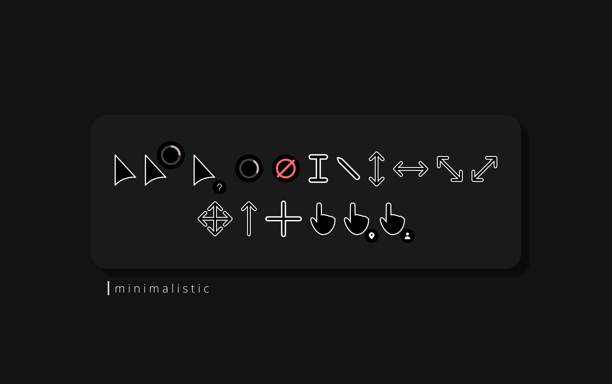
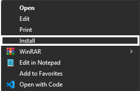
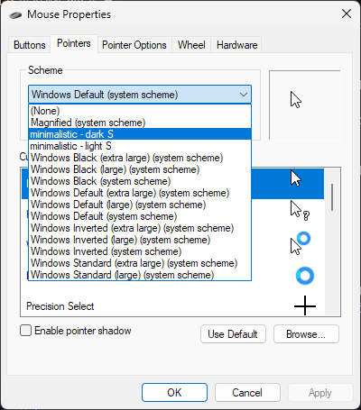

# Minimalistic Cursors

A simple and minimalist cursor for Windows, with a unique yet familliar design, focusing on usability than the looks while still looking aesthetically pleasing.

## Installation

Download the latest version from the Releases tab.

Unpack the `minimalistic-cursor-v1.0.zip`, then open both dark and light folders.

Right click on the `install.inf` and select "Install" to install the cursor theme.

## Setup

To change cursor theme, go to Mouse settings > Additional mouse settings > Pointers > select "minimalistic - dark S" or the white variant.

Your cursor should be changed accordingly to the chosen cursor theme.

### Miscellaneous Info

This cursor was made over a year ago, or possibly much more earlier than that before. i've only made the git repository just now, even though it's already slightly complete and already ready to use.
